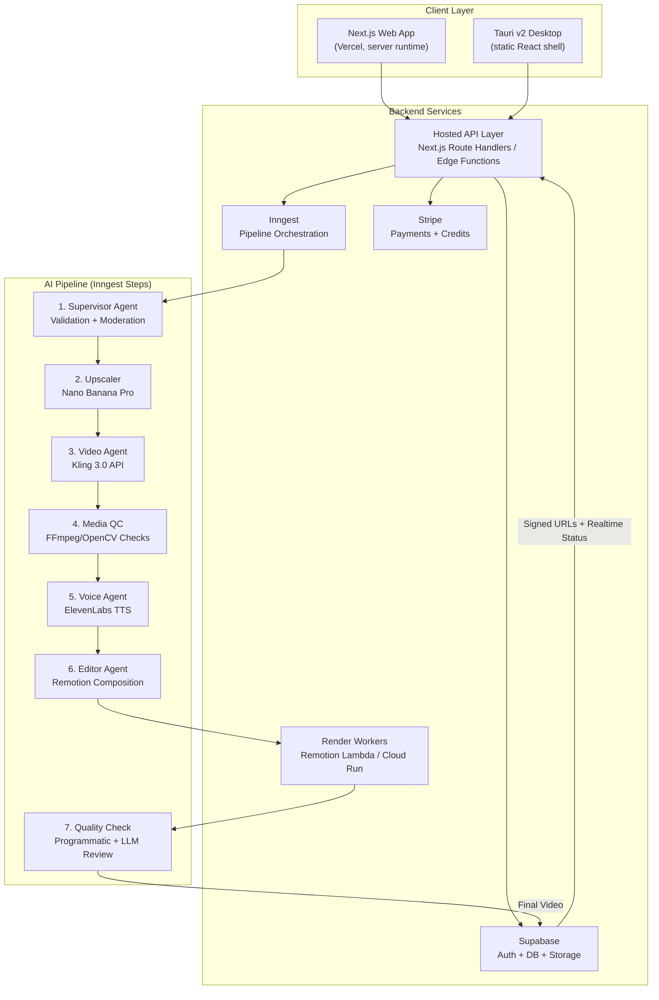

# Interior-Pro — AI Sales Video Generator for Luxury Furniture

A SaaS platform where luxury furniture sales managers upload product images and receive professionally composed sales pitch videos with voiceover, music, and logo overlays — all orchestrated by an agentic AI pipeline.

---

## Production Corrections Applied

> [!NOTE]
> **Desktop vs. Web-First Strategy**: ✅ Confirmed — **web-first + Tauri desktop wrapper**, with one important correction: the web app runs as a full Next.js app on Vercel, while the desktop app is a static Tauri shell that reuses the React UI packages and calls the hosted backend APIs. The Tauri build must not depend on Next.js API routes, SSR, middleware/proxy, rewrites, or default image optimization.

> [!NOTE]
> **Pricing Model**: ✅ Confirmed — **€479/month** flat fee (5 videos included) + pay-per-extra-video.

> [!NOTE]
> **AI Service Costs**: Initial target is **~$8-25 per completed video**, including generation retries, upscaling, TTS, rendering, storage egress, and QC. The earlier ~$2-8 estimate is treated as an optimistic best case until provider pricing and retry rates are validated with pilot data.

> [!IMPORTANT]
> **Production Readiness Correction**: Credits, subscriptions, and extra-video purchases must be implemented as a ledger with reservations, not as a mutable usage counter. This prevents double-spend, webhook replay issues, and race conditions when multiple pipelines start at the same time.

---

## Resolved Decisions

| Decision | Answer |
|----------|--------|
| **Brand Identity** | Premium dark-mode UI, luxury segment aesthetic (designed by us) |
| **Video Specs** | 1080p resolution, 30-45 seconds duration |
| **Music Library** | Pre-provided songs (admin-uploaded), each cut to ~1 minute |
| **Logo Overlay** | Customer's company logo (uploaded per project) |
| **Multi-tenancy** | Organization-based accounts from day one; single-user companies are just organizations with one member |
| **UI Language** | English + German (i18n from day one) |
| **Pricing** | €479/month (5 videos included) + extra videos purchasable |

---

## Architecture Overview



---

## Tech Stack Decisions

### Frontend & Desktop

| Layer | Choice | Rationale |
|-------|--------|-----------|
| **Web Framework** | **Next.js 16 (App Router)** | Current production baseline, Vercel-native, Route Handlers for webhooks/API, strong ecosystem |
| **Desktop Wrapper** | **Tauri v2** | Lightweight, secure desktop shell; production build uses static export and calls hosted APIs |
| **UI Library** | **shadcn/ui + Radix** | Premium, customizable, no vendor lock-in (you own the components) |
| **Styling** | **Tailwind CSS v4** | Industry standard for rapid UI development, pairs perfectly with shadcn |
| **State Management** | **TanStack Query + Zustand** | TanStack for server state, Zustand for client state |
| **Forms** | **React Hook Form + Zod** | Type-safe validation, excellent DX |
| **File Upload** | **Uppy** | Robust multi-file upload with progress, drag & drop, image preview |
| **i18n** | **next-intl** | Type-safe internationalization (EN + DE); avoid Next.js built-in i18n routing in the static Tauri export |
| **Monorepo** | **Turborepo** | Shared packages between web and desktop apps |

### Backend & Infrastructure

| Layer | Choice | Rationale |
|-------|--------|-----------|
| **Database** | **Supabase (PostgreSQL)** | Auth, DB, Storage, Edge Functions, Realtime — with explicit RLS on every exposed table |
| **Auth** | **Supabase Auth** | Built-in, supports OAuth, magic links, enterprise SSO ✓ |
| **Storage** | **Supabase Storage** | Private buckets for source/final assets, signed URLs for delivery, storage RLS policies |
| **Pipeline** | **Inngest** | Durable workflow execution, built-in retries, step functions, perfect for AI pipelines ✓ |
| **Payments** | **Stripe** | Subscriptions + one-time credit purchases ✓ |
| **Hosting** | **Vercel** | Next.js native deployment, route handlers, preview deployments, analytics |
| **Rendering** | **Remotion Lambda / Cloud Run** | Dedicated render workers; avoid rendering long MP4 jobs in regular Vercel request handlers |
| **Monitoring** | **Sentry** | Error tracking, performance monitoring, session replay |

### AI Services

| Service | Primary Choice | Fallback | Rationale |
|---------|---------------|----------|-----------|
| **Content Moderation** | **OpenAI Moderation API** (`omni-moderation-latest`) | Google Cloud Vision SafeSearch | Free for OpenAI users, multimodal (text + image), fast |
| **Image Upscaling / Enhancement** | **Nano Banana Pro** (`gemini-3-pro-image-preview`) | Magnific API / Replicate (Real-ESRGAN) | User-preferred upscale/enhancement step; supports high-quality image generation/editing workflows and 1K/2K/4K outputs |
| **Image-to-Video** | **Kling 3.0 API** | Runway Gen-4.5 / Gen-4 Turbo API | User-preferred video agent for photorealistic interior/furniture motion; Runway remains the reliability fallback |
| **Text-to-Speech** | **ElevenLabs** | OpenAI TTS | Industry-leading quality, voice cloning, emotional range — critical for luxury sales pitch feel |
| **LLM (Agent Brain)** | **Gemini 2.5 Pro** | Claude Sonnet 4.6 / OpenAI GPT-5.x | Image analysis, script generation, structured decisions; model names must be pinned and reviewed before launch |
| **Video Editing (Editor Agent)** | **Remotion + FFmpeg/OpenCV** | FFmpeg-only fallback | Remotion handles deterministic composition; FFmpeg/OpenCV handle measurable media checks such as black frames, blur, duration, bitrate, audio peaks, and loudness |

> [!TIP]
> **Why Nano Banana Pro + Kling 3.0?** Nano Banana Pro is used for the image enhancement/upscaling step before video generation. Kling 3.0 is the primary Video Agent because the target output depends on photorealistic furniture motion and controlled camera movement. Before production launch, confirm API access, SLA, throughput, content policy, and commercial pricing for Kling 3.0.

---

## Database Schema

### Core Tables

```sql
-- User profiles (linked to Supabase Auth)
CREATE TABLE profiles (
    id UUID PRIMARY KEY REFERENCES auth.users(id) ON DELETE CASCADE,
    full_name TEXT NOT NULL,
    email TEXT NOT NULL,
    avatar_url TEXT,
    preferred_language TEXT DEFAULT 'en' CHECK (preferred_language IN ('en', 'de')),
    settings JSONB DEFAULT '{}',
    created_at TIMESTAMPTZ DEFAULT now(),
    updated_at TIMESTAMPTZ DEFAULT now()
);

-- B2B tenant boundary. Single-user customers still get one organization.
CREATE TABLE organizations (
    id UUID PRIMARY KEY DEFAULT gen_random_uuid(),
    name TEXT NOT NULL,
    stripe_customer_id TEXT UNIQUE,
    subscription_plan TEXT DEFAULT 'trial' CHECK (subscription_plan IN ('trial', 'professional', 'enterprise')),
    settings JSONB DEFAULT '{}',
    created_by UUID REFERENCES profiles(id),
    created_at TIMESTAMPTZ DEFAULT now(),
    updated_at TIMESTAMPTZ DEFAULT now()
);

CREATE TABLE organization_members (
    organization_id UUID NOT NULL REFERENCES organizations(id) ON DELETE CASCADE,
    user_id UUID NOT NULL REFERENCES profiles(id) ON DELETE CASCADE,
    role TEXT NOT NULL CHECK (role IN ('owner', 'admin', 'member')),
    status TEXT NOT NULL DEFAULT 'active' CHECK (status IN ('active', 'invited', 'disabled')),
    created_at TIMESTAMPTZ DEFAULT now(),
    PRIMARY KEY (organization_id, user_id)
);

-- Pre-provided music tracks (admin-uploaded, ~1min each)
CREATE TABLE music_tracks (
    id UUID PRIMARY KEY DEFAULT gen_random_uuid(),
    name TEXT NOT NULL,
    file_storage_key TEXT NOT NULL,
    duration_seconds FLOAT NOT NULL,
    genre TEXT,
    is_active BOOLEAN DEFAULT true,
    created_at TIMESTAMPTZ DEFAULT now()
);

-- Subscription state is a cache of Stripe state, not the source of truth.
CREATE TABLE subscriptions (
    id UUID PRIMARY KEY DEFAULT gen_random_uuid(),
    organization_id UUID NOT NULL REFERENCES organizations(id) ON DELETE CASCADE,
    stripe_subscription_id TEXT UNIQUE NOT NULL,
    plan TEXT NOT NULL DEFAULT 'professional',
    status TEXT NOT NULL DEFAULT 'active' CHECK (status IN ('active', 'trialing', 'canceled', 'past_due', 'paused')),
    videos_per_month INTEGER NOT NULL DEFAULT 5,
    current_period_start TIMESTAMPTZ NOT NULL,
    current_period_end TIMESTAMPTZ NOT NULL,
    created_at TIMESTAMPTZ DEFAULT now(),
    updated_at TIMESTAMPTZ DEFAULT now()
);

-- Idempotency guard for Stripe webhooks.
CREATE TABLE stripe_events (
    id UUID PRIMARY KEY DEFAULT gen_random_uuid(),
    stripe_event_id TEXT UNIQUE NOT NULL,
    event_type TEXT NOT NULL,
    processed_at TIMESTAMPTZ DEFAULT now(),
    payload JSONB NOT NULL
);

-- Signed ledger. Positive amounts add credits; negative amounts are finalized consumption.
CREATE TABLE video_credit_ledger (
    id UUID PRIMARY KEY DEFAULT gen_random_uuid(),
    organization_id UUID NOT NULL REFERENCES organizations(id) ON DELETE CASCADE,
    project_id UUID,
    stripe_event_id TEXT REFERENCES stripe_events(stripe_event_id),
    entry_type TEXT NOT NULL CHECK (entry_type IN ('monthly_grant', 'purchase', 'consume', 'refund', 'adjustment')),
    amount INTEGER NOT NULL CHECK (amount <> 0),
    metadata JSONB DEFAULT '{}',
    created_at TIMESTAMPTZ DEFAULT now()
);

-- Prevents double-spend while a pipeline is running.
CREATE TABLE credit_reservations (
    id UUID PRIMARY KEY DEFAULT gen_random_uuid(),
    organization_id UUID NOT NULL REFERENCES organizations(id) ON DELETE CASCADE,
    project_id UUID UNIQUE,
    amount INTEGER NOT NULL DEFAULT 1 CHECK (amount > 0),
    status TEXT NOT NULL DEFAULT 'reserved' CHECK (status IN ('reserved', 'consumed', 'released', 'expired')),
    expires_at TIMESTAMPTZ NOT NULL DEFAULT (now() + interval '24 hours'),
    created_at TIMESTAMPTZ DEFAULT now(),
    updated_at TIMESTAMPTZ DEFAULT now()
);

-- Projects (each video generation job)
CREATE TABLE projects (
    id UUID PRIMARY KEY DEFAULT gen_random_uuid(),
    organization_id UUID NOT NULL REFERENCES organizations(id) ON DELETE CASCADE,
    created_by UUID NOT NULL REFERENCES profiles(id),
    status TEXT DEFAULT 'draft' CHECK (status IN (
        'draft', 'submitted', 'queued', 'validating', 'upscaling',
        'generating_video', 'media_qc', 'editing', 'rendering',
        'quality_check', 'completed', 'failed', 'canceled'
    )),
    credit_reservation_id UUID UNIQUE REFERENCES credit_reservations(id),
    -- User inputs
    customer_name TEXT NOT NULL,
    customer_logo_storage_key TEXT,
    music_id UUID REFERENCES music_tracks(id),
    voice_selection TEXT NOT NULL,
    special_notes TEXT,
    -- Results
    error_message TEXT,
    inngest_run_id TEXT,
    completed_at TIMESTAMPTZ,
    created_at TIMESTAMPTZ DEFAULT now(),
    updated_at TIMESTAMPTZ DEFAULT now()
);

-- Project images (uploaded + upscaled)
CREATE TABLE project_images (
    id UUID PRIMARY KEY DEFAULT gen_random_uuid(),
    project_id UUID NOT NULL REFERENCES projects(id) ON DELETE CASCADE,
    original_storage_key TEXT NOT NULL,
    upscaled_storage_key TEXT,
    -- Video Agent analysis
    analysis JSONB,
    prompt_type TEXT CHECK (prompt_type IN ('single_shot', 'multi_shot')),
    -- Generated video
    video_storage_key TEXT,
    video_status TEXT DEFAULT 'pending',
    order_index INTEGER NOT NULL,
    created_at TIMESTAMPTZ DEFAULT now()
);

-- Final output videos
CREATE TABLE project_outputs (
    id UUID PRIMARY KEY DEFAULT gen_random_uuid(),
    project_id UUID NOT NULL REFERENCES projects(id) ON DELETE CASCADE,
    video_storage_key TEXT NOT NULL,
    thumbnail_storage_key TEXT,
    duration_seconds FLOAT,
    resolution TEXT DEFAULT '1920x1080',
    file_size_bytes BIGINT,
    voiceover_script TEXT,
    qc_report JSONB DEFAULT '{}',
    created_at TIMESTAMPTZ DEFAULT now()
);

-- Pipeline logs (due diligence audit trail)
CREATE TABLE pipeline_logs (
    id UUID PRIMARY KEY DEFAULT gen_random_uuid(),
    project_id UUID NOT NULL REFERENCES projects(id) ON DELETE CASCADE,
    step TEXT NOT NULL,
    status TEXT NOT NULL CHECK (status IN ('started', 'completed', 'failed', 'skipped')),
    message TEXT,
    duration_ms INTEGER,
    metadata JSONB,
    created_at TIMESTAMPTZ DEFAULT now()
);

-- Add project references after both sides of the reservation/project flow exist.
ALTER TABLE credit_reservations
    ADD CONSTRAINT credit_reservations_project_fk
    FOREIGN KEY (project_id) REFERENCES projects(id) ON DELETE SET NULL;

ALTER TABLE video_credit_ledger
    ADD CONSTRAINT video_credit_ledger_project_fk
    FOREIGN KEY (project_id) REFERENCES projects(id) ON DELETE SET NULL;
```

### Row Level Security (RLS)

```sql
-- Enable RLS on every table in the exposed public schema.
ALTER TABLE profiles ENABLE ROW LEVEL SECURITY;
ALTER TABLE organizations ENABLE ROW LEVEL SECURITY;
ALTER TABLE organization_members ENABLE ROW LEVEL SECURITY;
ALTER TABLE music_tracks ENABLE ROW LEVEL SECURITY;
ALTER TABLE projects ENABLE ROW LEVEL SECURITY;
ALTER TABLE project_images ENABLE ROW LEVEL SECURITY;
ALTER TABLE project_outputs ENABLE ROW LEVEL SECURITY;
ALTER TABLE subscriptions ENABLE ROW LEVEL SECURITY;
ALTER TABLE stripe_events ENABLE ROW LEVEL SECURITY;
ALTER TABLE credit_reservations ENABLE ROW LEVEL SECURITY;
ALTER TABLE video_credit_ledger ENABLE ROW LEVEL SECURITY;
ALTER TABLE pipeline_logs ENABLE ROW LEVEL SECURITY;

CREATE POLICY "users_can_read_own_profile" ON profiles
    FOR SELECT
    TO authenticated
    USING (id = (SELECT auth.uid()));

CREATE POLICY "users_can_update_own_profile" ON profiles
    FOR UPDATE
    TO authenticated
    USING (id = (SELECT auth.uid()))
    WITH CHECK (id = (SELECT auth.uid()));

CREATE POLICY "authenticated_can_read_active_music_tracks" ON music_tracks
    FOR SELECT
    TO authenticated
    USING (is_active = true);

-- Helper pattern: a user can access rows for organizations where they are active members.
CREATE POLICY "members_can_read_projects" ON projects
    FOR SELECT
    TO authenticated
    USING (
        EXISTS (
            SELECT 1 FROM organization_members om
            WHERE om.organization_id = projects.organization_id
              AND om.user_id = (SELECT auth.uid())
              AND om.status = 'active'
        )
    );

CREATE POLICY "members_can_insert_projects" ON projects
    FOR INSERT
    TO authenticated
    WITH CHECK (
        created_by = (SELECT auth.uid())
        AND EXISTS (
            SELECT 1 FROM organization_members om
            WHERE om.organization_id = projects.organization_id
              AND om.user_id = (SELECT auth.uid())
              AND om.status = 'active'
        )
    );

-- Join-scoped tables use the parent project for authorization.
CREATE POLICY "members_can_read_project_images" ON project_images
    FOR SELECT
    TO authenticated
    USING (
        EXISTS (
            SELECT 1
            FROM projects p
            JOIN organization_members om ON om.organization_id = p.organization_id
            WHERE p.id = project_images.project_id
              AND om.user_id = (SELECT auth.uid())
              AND om.status = 'active'
        )
    );

-- Service-role-only operations:
-- - pipeline status writes
-- - credit ledger inserts
-- - Stripe webhook processing
-- - output asset writes
-- - music track administration
-- Never expose SUPABASE_SERVICE_ROLE_KEY to browser or Tauri clients.
```

### Storage Policy

Supabase Storage buckets must be private by default:

- `project-source-assets`: uploaded customer images and logos
- `project-generated-clips`: AI-generated clips
- `project-final-outputs`: final MP4s and thumbnails
- `music-tracks`: admin-managed music library

Storage object paths should include the organization and project boundary, for example:

```text
{organization_id}/{project_id}/source/{image_id}.jpg
{organization_id}/{project_id}/outputs/final.mp4
```

Access is granted with signed URLs or storage RLS policies on `storage.objects`. Upload and upsert policies must explicitly cover `INSERT`, `SELECT`, and `UPDATE`.

---

## AI Pipeline Architecture (Inngest)

The pipeline is implemented as one Inngest function with durable, idempotent steps. The project submission API creates the project and reserves one video credit before the event is sent. The pipeline consumes the reservation only after a successful final output; failed or rejected jobs release the reservation.

```mermaid
graph LR
    SUBMIT["API Submit Project"] --> RESERVE["Atomic Credit Reservation"]
    RESERVE --> TRIGGER["project.submitted<br/>Event Trigger"]
    TRIGGER --> VALIDATE
    
    subgraph "Step 1: Supervisor Agent"
        VALIDATE["Validate Inputs<br/>+ NSFW Check"]
    end
    
    VALIDATE -->|"PASS"| UPSCALE
    VALIDATE -->|"FAIL"| RELEASE["Release Reservation<br/>+ Error Response"]
    
    subgraph "Step 2: Upscaler"
        UPSCALE["Nano Banana Pro<br/>Enhance + Upscale Images"]
    end
    
    UPSCALE --> ANALYZE
    
    subgraph "Step 3: Video Agent"
        ANALYZE["LLM Analyzes<br/>Image Perspectives"]
        ANALYZE --> ASSIGN["Assign Prompt Types<br/>2× Multi-Shot<br/>Rest× Single-Shot"]
        ASSIGN --> GENERATE["Generate Videos<br/>(Kling 3.0 primary / Runway fallback)"]
    end
    
    GENERATE --> MEDIAQC
    
    subgraph "Step 4: Media QC + Editor Agent"
        MEDIAQC["FFmpeg/OpenCV Checks<br/>duration, black frames, blur, audio"]
        MEDIAQC --> EDIT["Clip Selection<br/>+ Cutting Plan"]
        EDIT --> VOICE["Generate Voiceover<br/>(ElevenLabs)"]
        VOICE --> COMPOSE["Remotion Composition<br/>Music + Voice + Logo"]
    end
    
    COMPOSE --> RENDER["Render Worker<br/>Remotion Lambda / Cloud Run"]
    RENDER --> QC
    
    subgraph "Step 5: Quality Check"
        QC["Programmatic Checks<br/>+ LLM Review"]
    end
    
    QC -->|"PASS"| DELIVER["Upload Final<br/>Consume Reservation<br/>Notify User"]
    QC -->|"FAIL, retryable"| EDIT
    QC -->|"FAIL, terminal"| RELEASE
```



### Pipeline Steps Detail

#### Step 0: Project Submission + Credit Reservation
```
Input:  Authenticated user, organization_id, uploaded asset references, project config
Action:
  1. Verify user is an active organization member
  2. Validate minimum/maximum image count before paid work starts
  3. Atomically reserve 1 video credit using a DB transaction/RPC
  4. Create project with credit_reservation_id
  5. Send project.submitted event to Inngest
Output: Queued project OR explicit insufficient-credit error
```

#### Step 1: Supervisor Agent
```
Input:  Project data (images, parameters)
Action: 
  1. Verify 5-8 images uploaded
  2. Run OpenAI Moderation API on all images (NSFW detection)
  3. Validate customer name, music selection, voice selection
  4. Confirm reservation still exists and has not expired
Output: Validated project OR error + reservation release
MD:     supervisor.md (validation rules)
```

#### Step 2: Image Upscaler
```
Input:  Validated images from DB
Action:
  1. Send each image to Nano Banana Pro (`gemini-3-pro-image-preview`) with a furniture-safe enhancement prompt
  2. Enhance materials, lighting, and composition while preserving product geometry and brand-relevant details
  3. Generate 2K/4K output as required by the video provider
  4. Store enhanced/upscaled images back to private Supabase Storage
Output: Upscaled storage keys in DB
```

#### Step 3: Video Agent
```
Input:  Upscaled images from DB
Action:
  1. LLM analyzes each image: perspective, angle width, content visibility
  2. Ranks images by "widest angle + most visible content"
  3. Top 2 images → multi-shot prompt (complex camera movement)
  4. Remaining images → single-shot prompt (orbit around motion)
  5. Generates videos via Kling 3.0 API first; Runway remains the fallback provider
  6. Stores generated clips in private storage and DB
Output: Video clips for each image
MD:     video-agent.md (prompt selection rules)
```

#### Step 4: Media QC + Editor Agent
```
Input:  Generated video clips + project JSON (customer name, music, voice, notes)
Engine: FFmpeg/OpenCV for measurable checks, Remotion for composition
Action:
  Phase A — Clip Processing:
    1. Probe every clip with FFmpeg/ffprobe
    2. Detect duration, black frames, frozen frames, high blur, bitrate issues, loudness
    3. Mark unusable clips and build a deterministic cutting plan
    4. Select clean segments and transition points

  Phase B — Voiceover Generation:
    5. LLM generates voiceover script based on customer name + notes + editor-agent.md
    6. ElevenLabs generates voiceover audio with selected voice

  Phase C — Final Composition (Remotion):
    7. Remotion assembles the final video composition:
       - Sequence clips per editor-agent.md rules
       - Apply smooth transitions between clips (crossfade, zoom, etc.)
       - Layer music track (per music.md selection + volume ducking)
       - Overlay voiceover audio (synced to clip transitions)
       - Add logo intro overlay (animated)
       - Add logo outro overlay (animated)
       - Dispatch final render to Remotion Lambda / Cloud Run worker
Output: Final composed video (MP4, 1080p)
MD:     editor-agent.md, music.md
```

> [!TIP]
> **Why Remotion + FFmpeg/OpenCV?** Remotion is excellent for deterministic, version-controlled composition. FFmpeg/OpenCV are better for measurable media diagnostics. The LLM decides creative intent; deterministic code validates, cuts, composes, and renders.

#### Step 5: Quality Check
```
Input:  Final rendered video
Action:
  1. Programmatic checks: duration, resolution, codec, file size, loudness, silence, black frames
  2. LLM/vision review: visual quality, logo placement, voiceover clarity, luxury tone
  3. Retry edit/render at most 2 times for retryable failures
  4. On PASS, consume reserved credit and mark project completed
  5. On terminal FAIL, release reservation and store actionable error
Output: PASS → deliver to user | FAIL → retry or release reservation
```

---

## Monorepo Structure

```
interior-pro/
├── apps/
│   ├── web/                          # Next.js 16 web app
│   │   ├── src/
│   │   │   ├── app/                  # App Router pages
│   │   │   │   ├── (auth)/           # Login, Register, Forgot Password
│   │   │   │   ├── (dashboard)/      # Main app layout
│   │   │   │   │   ├── page.tsx      # Dashboard overview
│   │   │   │   │   ├── projects/     # Project list + detail
│   │   │   │   │   ├── new/          # New project wizard
│   │   │   │   │   ├── settings/     # Profile + organization settings
│   │   │   │   │   └── billing/      # Stripe + credits
│   │   │   │   └── api/              # API routes
│   │   │   │       ├── inngest/      # Inngest webhook endpoint
│   │   │   │       └── stripe/       # Stripe webhook endpoint
│   │   │   ├── components/           # shadcn/ui + custom components
│   │   │   ├── lib/                  # Utilities, Supabase client, etc.
│   │   │   └── styles/               # Global CSS
│   │   ├── next.config.ts
│   │   └── package.json
│   │
│   └── desktop/                      # Tauri v2 static shell (Phase 6)
│       ├── src-tauri/                # Rust backend
│       │   ├── src/
│       │   │   └── main.rs
│       │   ├── Cargo.toml
│       │   └── tauri.conf.json
│       └── package.json
│
├── packages/
│   ├── ui/                           # Shared UI components (shadcn)
│   ├── shared/                       # Shared types, utils, constants
│   ├── supabase/                     # Supabase client, RLS helpers + generated types
│   ├── billing/                      # Credit ledger, reservations, Stripe helpers
│   ├── pipeline/                     # Inngest functions + agent logic
│   │   ├── src/
│   │   │   ├── inngest/
│   │   │   │   ├── client.ts         # Inngest client config
│   │   │   │   └── functions/
│   │   │   │       ├── supervisor.ts
│   │   │   │       ├── upscaler.ts
│   │   │   │       ├── video-agent.ts
│   │   │   │       ├── editor-agent.ts
│   │   │   │       └── quality-check.ts
│   │   │   ├── agents/               # Agent MD files + prompts
│   │   │   │   ├── supervisor.md
│   │   │   │   ├── video-agent.md
│   │   │   │   ├── editor-agent.md
│   │   │   │   └── music.md
│   │   │   └── services/             # AI service wrappers
│   │   │       ├── gemini-image.ts
│   │   │       ├── kling.ts
│   │   │       ├── runway.ts
│   │   │       ├── magnific.ts
│   │   │       ├── elevenlabs.ts
│   │   │       ├── openai-moderation.ts
│   │   │       ├── media-qc.ts
│   │   │       └── remotion.ts
│   │   └── package.json
│   │
│   └── video/                        # Remotion video compositions
│       ├── src/
│       │   ├── compositions/
│       │   │   ├── SalesPitch.tsx     # Main video composition
│       │   │   ├── LogoIntro.tsx      # Logo overlay intro
│       │   │   ├── LogoOutro.tsx      # Logo overlay outro
│       │   │   └── Transition.tsx     # Clip transitions
│       │   └── Root.tsx
│       └── package.json
│
├── supabase/
│   ├── migrations/                   # SQL migrations
│   ├── seed.sql                      # Seed data
│   └── config.toml
│
├── turbo.json                        # Turborepo config
├── package.json                      # Root package.json
└── .env.example                      # Environment variables template
```

---

## Frontend Pages & UX Flow

### Page Map

| Route | Page | Description |
|-------|------|-------------|
| `/login` | Login | Email + password, OAuth (Google), magic link |
| `/register` | Register | Create account + organization |
| `/` | Dashboard | Overview: recent projects, credits balance, usage stats |
| `/projects` | Projects List | All projects with status filters, search |
| `/projects/new` | New Project | Multi-step wizard: upload images → set params → confirm |
| `/projects/[id]` | Project Detail | Live pipeline status, preview clips, watch final video |
| `/settings` | Settings | Profile, organization, members, default voice/music settings |
| `/billing` | Billing | Subscription plan, credit balance, ledger, invoices, extra-video purchases |

### New Project Wizard (Core UX)

```
┌─────────────────────────────────────────────────┐
│  Step 1: Upload Images                          │
│  ┌──────┐ ┌──────┐ ┌──────┐ ┌──────┐ ┌──────┐  │
│  │  📷  │ │  📷  │ │  📷  │ │  📷  │ │  +   │  │
│  │ img1 │ │ img2 │ │ img3 │ │ img4 │ │ add  │  │
│  └──────┘ └──────┘ └──────┘ └──────┘ └──────┘  │
│  Drag & drop or click to upload (5-8 images)    │
├─────────────────────────────────────────────────┤
│  Step 2: Configure                              │
│  Customer Name:  [________________________]     │
│  Customer Logo:  [📎 Upload Logo        ]       │
│  Music Track:    [🎵 Elegant Piano       ▾]     │
│  Speaker Voice:  [🎙️ James - Deep Warm   ▾]     │
│  Special Notes:  [________________________]     │
│                  [________________________]     │
├─────────────────────────────────────────────────┤
│  Step 3: Review & Generate                      │
│  Summary of selections                          │
│  Videos remaining: 3 of 5 this month            │
│              [Generate Sales Video →]           │
└─────────────────────────────────────────────────┘
```

---

## Payment System (Stripe) — Subscription + Credit Ledger

### Subscription Tiers

| Plan | Monthly Fee | Videos Included | Extra Videos |
|------|------------|-----------------|---------------|
| **Professional** | **€479/mo** | 5 videos/mo | Pay-per-video (via Stripe Checkout) |
| **Enterprise** | Custom | Unlimited | Included |

### How It Works

1. **Monthly subscription** grants 5 credits by inserting `monthly_grant` rows into `video_credit_ledger`.
2. **Available credits** are computed from the ledger minus active reservations.
3. Before a pipeline starts, the API creates a `credit_reservations` row in one transaction.
4. On successful final delivery, the reservation becomes `consumed` and a negative `consume` ledger entry is inserted.
5. On validation failure, terminal render failure, or cancellation, the reservation is `released` without changing the ledger.
6. Extra videos are purchased as one-time Stripe Checkout payments and inserted as `purchase` ledger entries.

### Stripe Integration

1. **Subscriptions**: Stripe Billing for monthly recurring plans
2. **Extra Videos**: Stripe Checkout (one-time payment) → webhook → `video_credit_ledger.purchase`
3. **Webhook Idempotency**: Store every Stripe event in `stripe_events` before mutating billing state
4. **Usage Metering**: Ledger + reservations, never a mutable `videos_used_this_period` counter
5. **Limit Enforcement**: DB RPC atomically checks balance and creates reservation
6. **Period Grant**: Stripe `invoice.paid` inserts monthly credit grant for the new billing period
7. **Raw Body Verification**: Stripe webhook handlers must verify signatures against the raw request body

### Credit Balance Rule

```sql
available_credits =
  SUM(video_credit_ledger.amount)
  - SUM(active credit_reservations.amount)
```

The production implementation should expose this through a database function/RPC so frontend and backend never reimplement balance logic differently.

---

## Exit-Readiness (Due Diligence)

The following practices are baked into the architecture from day one:

### Code Quality
- [x] **TypeScript** everywhere (strict mode)
- [x] **ESLint + Prettier** enforced via CI
- [x] **Monorepo** with clean separation of concerns
- [x] **shadcn/ui** — no vendor lock-in (components are owned, not dependencies)

### Security
- [x] **Supabase RLS** — multi-tenant data isolation at DB level
- [x] **Private storage buckets** — signed URLs for customer assets and final videos
- [x] **Service-role isolation** — service key only in backend/worker environments
- [x] **Content moderation** — NSFW detection before pipeline starts
- [x] **Zod validation** — all inputs validated server-side
- [x] **No copyleft** — MIT/Apache-2.0 licensed dependencies only

### Audit & Compliance
- [x] **Pipeline logs** — every step is logged with timing + metadata
- [x] **Credit ledger** — immutable financial/usage audit trail with reservations
- [x] **Stripe event table** — webhook replay and idempotency protection
- [x] **Supabase audit logs** — auth events, data changes
- [x] **GDPR-ready** — data export/deletion plan including storage objects and third-party AI processors

### DevOps
- [x] **CI/CD** — GitHub Actions for lint, test, build, deploy
- [x] **Staging environment** — Supabase branch + Vercel preview
- [x] **Sentry** — error tracking + performance monitoring
- [x] **Automated backups** — Supabase point-in-time recovery
- [x] **Render observability** — logs and cost metrics for Remotion render workers

### Documentation
- [x] Architecture diagrams (Mermaid)
- [x] API documentation (auto-generated from Zod schemas)
- [x] Agent MD files (version controlled)
- [x] README per package

---

## Implementation Phases

### Phase 1: Foundation (Week 1-2)
- Monorepo setup (Turborepo + pnpm)
- Next.js 16 app with App Router
- Supabase project + database migrations
- Supabase Auth (login, register, organization creation)
- Organization membership model + RLS policies
- Private storage buckets + signed URL helpers
- Basic dashboard layout with shadcn/ui
- Environment configuration

### Phase 2: Core UI (Week 2-3)
- New Project wizard (upload, configure, review)
- Projects list with status indicators
- Project detail page with real-time status
- Settings page (profile, organization, members)
- File upload with Uppy + Supabase Storage
- Responsive design + dark mode

### Phase 3: AI Pipeline (Week 3-6)
- Inngest setup + webhook endpoint
- Credit reservation before project.submitted event
- Supervisor Agent (validation + moderation)
- Nano Banana Pro integration (image enhancement/upscaling via `gemini-3-pro-image-preview`)
- Video Agent (LLM analysis + Kling 3.0 generation; Runway fallback)
- FFmpeg/OpenCV media QC checks
- ElevenLabs integration (voiceover)
- Remotion compositions (final video)
- Render worker setup (Remotion Lambda / Cloud Run)
- Editor Agent (clip cutting plan + composition)
- Quality Check Agent
- Real-time status updates via Supabase Realtime

### Phase 4: Payments (Week 5-6)
- Stripe subscription integration
- Credit ledger and reservation system
- Billing page + transaction history
- Stripe webhooks with raw body signature verification
- Webhook idempotency via `stripe_events`
- Usage limits via DB RPC

### Phase 5: Polish & Testing (Week 7-10)
- End-to-end testing (Playwright)
- Error handling + edge cases
- Sentry integration
- Performance optimization
- CI/CD pipeline (GitHub Actions)
- Security audit (RLS, input validation, API keys)
- Provider cost benchmarking and retry-rate measurement

### Phase 6: Desktop App (Week 10-12)
- Tauri v2 project setup
- Static export configuration for the desktop shell
- Verify no desktop bundle depends on Route Handlers, SSR, middleware/proxy, or server-only env vars
- Desktop-specific features (auto-update, system tray)
- Windows + macOS builds via GitHub Actions
- Code signing + distribution

> [!NOTE]
> The 8-week schedule is realistic for a demo/pilot MVP only. A production-ready B2B SaaS with billing, render workers, provider fallback, security testing, and desktop signing should be planned as a 12-16 week build.

---

## Verification Plan

### Automated Tests
- **Unit tests**: Zod schemas, utility functions, credit calculations
- **Integration tests**: Inngest pipeline steps (using Inngest dev server)
- **Database tests**: RLS policies, credit reservation RPC, ledger balance calculations
- **Webhook tests**: Stripe signature verification, duplicate event replay, subscription renewals
- **E2E tests**: Full user flow with Playwright (upload → generate → view)
- **Commands**: `pnpm test`, `pnpm test:e2e`, `pnpm lint`

### Manual Verification
- Upload test images → verify pipeline completes → watch output video
- Test NSFW image rejection → verify reservation release without credit consumption
- Test insufficient credits → verify abort + error message
- Test Stripe subscription flow → verify credits added
- Test duplicate Stripe webhook replay → verify no duplicate credits
- Test failed render → verify reservation release and actionable error
- Test Tauri desktop build on Windows + macOS
- Review final video quality (transitions, voiceover sync, logo placement)

---

## Environment Variables

```env
# Supabase
NEXT_PUBLIC_SUPABASE_URL=
NEXT_PUBLIC_SUPABASE_ANON_KEY=
SUPABASE_SERVICE_ROLE_KEY=

# Inngest
INNGEST_EVENT_KEY=
INNGEST_SIGNING_KEY=

# Stripe
STRIPE_SECRET_KEY=
STRIPE_WEBHOOK_SECRET=
NEXT_PUBLIC_STRIPE_PUBLISHABLE_KEY=

# AI Services
OPENAI_API_KEY=           # Moderation + LLM agent brain
GEMINI_API_KEY=           # Nano Banana Pro image enhancement/upscaling
KLING_API_KEY=            # Primary image-to-video generation via Kling 3.0
RUNWAY_API_KEY=           # Fallback image-to-video generation
MAGNIFIC_API_KEY=         # Optional fallback image upscaling
ELEVENLABS_API_KEY=       # Text-to-speech voiceover

# Rendering
REMOTION_AWS_ACCESS_KEY_ID=
REMOTION_AWS_SECRET_ACCESS_KEY=
REMOTION_AWS_REGION=
RENDER_WORKER_WEBHOOK_SECRET=

# Monitoring
SENTRY_DSN=
NEXT_PUBLIC_SENTRY_DSN=
```
